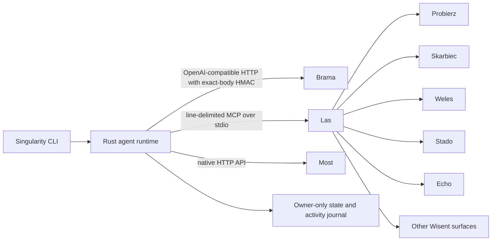

# Singularity

Singularity is the native Rust runtime for autonomous Wisent agents. It runs an auditable model-and-tool loop while delegating platform concerns to the existing Wisent services instead of copying them into this repository.

The repository contains no Python runtime, Python package, dynamic Python skills, direct model-provider implementations, or local model server.

## Architecture



- **Brama** owns provider selection, subscription routing, retry chains, credential brokering, reauthentication, and local or cloud inference. Singularity sends native OpenAI function definitions and consumes native tool calls.
- **Las** owns federation of Wisent MCP surfaces. Singularity starts it as a supervised child process, discovers the current namespaced tool catalog, and routes calls without changing names, schemas, or responses.
- **Probierz** remains the source of truth for web, mobile, Electron, and native desktop test execution and analysis. Its tools are consumed through Las.
- **Skarbiec** remains the credential vault. Its model-facing tools are consumed through Las; bootstrap credentials for Brama and Most are materialized before Singularity starts and passed as owner-only file paths.
- **Most** remains the communication service. Singularity exposes native tools for health, chat creation, and text-message sending; it does not duplicate Apple, Twilio, worker affinity, storage, or webhook transport logic.

## Runtime

Each cycle:

- appends the current budget and recent outcomes to the conversation;
- sends the typed transcript and merged tool catalog to Brama;
- validates and executes native tool calls sequentially;
- feeds every success or failure back as a structurally valid tool message;
- charges configured token and instance rates exactly once;
- atomically saves versioned state and appends an activity event;
- stops on a final model response, the configured tool-round bound, budget exhaustion, or cancellation.

Effectful remote calls are never automatically retried after an ambiguous network or protocol failure.

## Build and install

```bash
cargo build --locked
cargo install --path . --locked
```

The installed executable is `singularity`.

## Commands

```bash
singularity run
singularity once
singularity doctor
singularity tools
```

- `run` executes cycles until cancellation or budget exhaustion.
- `once` executes one bounded cycle and prints a JSON report.
- `doctor` verifies configuration, Brama readiness and model availability, Most send readiness, Las federation, and required MCP surfaces.
- `tools` prints the merged dynamic Las and native Most tool catalog without invoking a model.

## Configuration

### Agent and state

| Variable | Purpose |
|---|---|
| `SINGULARITY_AGENT_NAME` | Agent display name |
| `SINGULARITY_AGENT_TICKER` | Stable agent ticker |
| `SINGULARITY_AGENT_TYPE` | Agent category |
| `SINGULARITY_SPECIALTY` | Preferred domain |
| `SINGULARITY_STATE_DIR` | Owner-only state and activity directory |
| `SINGULARITY_STARTING_BALANCE_USD` | Initial budget |
| `SINGULARITY_INSTANCE_USD_PER_HOUR` | Instance cost rate |
| `SINGULARITY_CYCLE_INTERVAL_SECS` | Pause between cycles |
| `SINGULARITY_MAX_TOOL_ROUNDS` | Bound on model and tool rounds per cycle |

### Brama

| Variable | Purpose |
|---|---|
| `BRAMA_BASE_URL` | Brama service origin |
| `BRAMA_MODEL` | Model or selector such as `any` or `task:<name>` |
| `BRAMA_AGENT_ID` | Identity included in HMAC headers |
| `BRAMA_HMAC_SECRET_FILE` | Owner-only file containing the matching agent HMAC value |
| `BRAMA_MAX_TOKENS` | Completion output bound |
| `BRAMA_TEMPERATURE` | Sampling temperature |
| `BRAMA_INPUT_PRICE_USD_PER_MILLION` | Budget rate for prompt tokens |
| `BRAMA_OUTPUT_PRICE_USD_PER_MILLION` | Budget rate for completion tokens |

Singularity serializes a completion request once, hashes and signs those exact bytes, and sends the same byte buffer. It never copies Brama provider credentials into the transcript or activity log.

### Las and ecosystem surfaces

| Variable | Purpose |
|---|---|
| `LAS_COMMAND` | Executable used to start Las |
| `LAS_MCP_ENTRYPOINT` | Path to the Las MCP entrypoint |
| `LAS_ONLY` | Surfaces enabled for the session |
| `LAS_SKIP` | Optional surfaces excluded from the session |
| `SINGULARITY_REQUIRED_SURFACES` | Prefixes that must be present after discovery |
| `SINGULARITY_MCP_TIMEOUT_SECS` | Request deadline enforced around Las |

Las tools retain their canonical `<surface>__<tool>` names. If a required child is unavailable, startup fails instead of silently substituting another implementation.

### Most

| Variable | Purpose |
|---|---|
| `MOST_BASE_URL` | Most service origin |
| `MOST_SERVICE_TOKEN_FILE` | Owner-only file containing the service bearer |

Singularity uses the native Most response shape. A healthy process with no active backend is not considered send-ready. Unsupported capabilities and pinned-worker outages remain visible to the model and operator.

### Operational settings

| Variable | Purpose |
|---|---|
| `SINGULARITY_HTTP_TIMEOUT_SECS` | Brama and Most request deadline |
| `SINGULARITY_SHUTDOWN_GRACE_SECS` | Graceful Las shutdown period |
| `RUST_LOG` | Rust tracing filter |

## State and audit

The state directory contains:

- `state.json`, an atomically replaced, versioned snapshot containing identity, budget, transcript, actions, and created Most resource identifiers;
- `activity.jsonl`, an append-only operational journal containing lifecycle, cost, model, and tool outcome events.

The directory and files are owner-only on Unix. State corruption and unsupported schema versions fail closed. Raw bootstrap credentials are never serialized.

## Breaking cutover

The former `singularity-ai` Python distribution and `from singularity import ...` API no longer exist. There are no compatibility shims. Install and operate the Rust binary or consume the Rust library crate.

The previous README-only claims around automatic self-modification, persistent Cognee memory, life creation, crypto wallets, direct providers, and Python skill marketplaces are intentionally absent because they were not complete executable contracts in the repository.

## License

MIT
