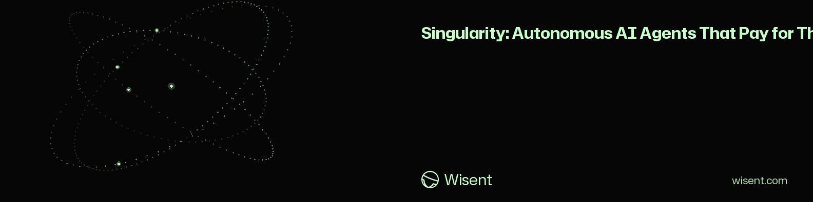

<!-- wisent-banner:start -->
<p align="center">
  
</p>
<!-- wisent-banner:end -->

<!-- wisent-readme-signals:start -->
[](https://github.com/wisent-ai/singularity) [](https://github.com/wisent-ai/singularity/issues) [](https://wisent.com) [](https://discord.gg/qRjpkthq54) [](https://www.linkedin.com/company/wisent-ai/) [](https://x.com/wisentai) [](https://calendly.com/lbartoszcze)
<!-- wisent-readme-signals:end -->

# Singularity: Autonomous AI Agents That Pay for Themselves

Singularity owns the durable lifecycle of an autonomous Wisent mission. Jeden
owns the model-and-tool loop. Las exposes the approved Wisent product surfaces
to Jeden without moving their policy or behavior into either runtime.

Version `0.4.0` is a breaking cutover. Singularity no longer calls Brama, starts
Las, executes Most actions, parses model tool calls, or maintains a second agent
transcript. The former `0.3.x` direct runtime and the older Python package are not
retained as compatibility paths.

## Ownership

```text
Stado placement / lifecycle
            │
            ▼
Singularity mission supervisor
  goal · cycle budget · schedule · resume pointer · activity journal
            │ jeden RPC over stdio
            ▼
Jeden agent harness
  model loop · transcript · memory · approvals · jailed tools · MCP client
       │                         │
       │ signed inference        │ one configured MCP server
       ▼                         ▼
     Brama                      Las
                                 │
         ┌───────────┬───────────┼───────────┬───────────┐
         ▼           ▼           ▼           ▼           ▼
       Weles      Skarbiec      Tama        Stado      Probierz …
```

- **Singularity** owns an immutable goal, an execution-cycle budget, the interval
  between cycles, a pointer to the durable Jeden session, and an append-only
  lifecycle journal.
- **Jeden** is the only reasoning and tool runtime. It owns the model transcript,
  context, memory, approvals, filesystem/process boundaries, and MCP client.
- **Brama** owns inference routing and provider/subscription credentials.
- **Las** owns the signed, namespaced federation catalogue. Routing through Las
  never broadens a child product's authority.
- **Stado** owns where the process runs and how its release is promoted.
- **Skarbiec**, **Tama**, **Probierz**, **Most**, **Weles**, and every other child
  retain their existing product boundaries.

An agent does not automatically receive every tool. Its operator-approved Las
release and filters define the available subset; Singularity requires the Las
server to be present and enabled in Jeden's merged MCP configuration.

## Runtime flow

`singularity run` performs these steps:

1. Canonicalizes the workspace and validates an enabled local stdio `las` entry
   in `~/.jeden/mcp.json` or `<workspace>/.jeden/mcp.json`.
2. Opens owner-only Singularity state and rejects a resume whose identity, goal,
   workspace, model, approval policy, step bound, or cycle budget changed.
3. Starts the exact configured Jeden executable as `jeden rpc` over stdio and
   validates protocol version 1.
4. Creates a new Jeden session or resumes the recorded session path.
5. Sends the immutable mission as Jeden's separate `goal` and asks Jeden to
   complete one bounded autonomous work cycle using its full approved harness.
6. Records the final result and Jeden session path. `COMPLETE` ends the mission;
   `CONTINUE` schedules the next cycle until the cycle budget is exhausted or the
   process is cancelled.

Each Jeden prompt is already a complete bounded agent run. Singularity never
replays an ambiguous failed prompt automatically. An unattended approval request
is denied, and an elicitation fails closed; managed deployments must grant the
required authority explicitly through the configured Jeden policy.

## Prerequisites

- Rust 1.85 or newer for a source build;
- a runnable Jeden binary with its Brama identity provisioned;
- a coordinated Wisent workspace;
- an enabled Las stdio entry in Jeden MCP configuration;
- current signed Las release manifest, signature, trust store, and watermark;
- child-specific credentials and policies owned by their respective products.

Minimal project MCP shape:

```json
{
  "mcpServers": {
    "las": {
      "command": "/absolute/path/to/node",
      "args": ["/absolute/path/to/las/src/mcp.mjs"],
      "cwd": "/absolute/path/to/las",
      "env": {
        "HOME": "/operator/home",
        "PATH": "/usr/local/bin:/usr/bin:/bin",
        "LAS_RELEASE_MANIFEST_FILE": "/secure/las/release-manifest.json",
        "LAS_RELEASE_MANIFEST_SIGNATURE_FILE": "/secure/las/release-manifest.sig.json",
        "LAS_RELEASE_TRUST_STORE_FILE": "/secure/las/trust-store.json",
        "LAS_RELEASE_WATERMARK_FILE": "/secure/las/watermark.json",
        "LAS_ONLY": "weles,skarbiec,tama,stado,lem,echo,most,probierz,byk,brama"
      }
    }
  }
}
```

The file contains approved configuration and paths, not raw provider secrets.
Jeden clears inherited environment variables when it starts an MCP child, so
every value Las needs must be declared deliberately.

## Commands

```text
singularity run     run scheduled Jeden cycles until completion or cycle limit
singularity once    execute one Jeden cycle and print its JSON report
singularity doctor  validate Las configuration and delegate readiness to Jeden
singularity tools   validate Las configuration and print Jeden's tool catalogue
```

## Policy-isolated companion binaries

The crate also builds three narrow companions. They are not alternate agent
runtimes and do not bypass Jeden:

- `singularity-bootstrap` verifies an operator-signed workload manifest,
  redeems only its declared Brama and Most capabilities through the local
  Skarbiec broker, and starts the canonical `singularity` executable with
  owner-only materialized inputs;
- `singularity-repo-mcp` exposes only the repository proposal workflow allowed
  by an owner-controlled policy and state directory;
- `singularity-finance-mcp` exposes proposal, status and cancellation under an
  offline-signed policy and enable lease; it has no payment credential or
  broadcaster.

Las may federate the two MCP companions as separate child processes. The
Singularity mission supervisor still talks only to Jeden, and Jeden remains the
sole reasoning and tool runtime.

Example:

```bash
export JEDEN_COMMAND=/absolute/path/to/jeden
export SINGULARITY_WORKSPACE=/absolute/path/to/workspace
export SINGULARITY_GOAL='Maintain the assigned product objective end to end'
export SINGULARITY_MAX_CYCLES=100
export SINGULARITY_MAX_STEPS=64

singularity doctor
singularity once
singularity run --resume
```

Writes, commands, and automatic approvals default to disabled. A managed launch
may set `SINGULARITY_ALLOW_WRITE`, `SINGULARITY_ALLOW_COMMAND`, and
`SINGULARITY_AUTO_APPROVE` only from its explicit workload policy.

## Configuration

| Variable | Purpose |
|---|---|
| `JEDEN_COMMAND` | Exact Jeden executable; default `jeden` on `PATH` |
| `JEDEN_MODEL` | Optional Jeden model or Brama selector |
| `SINGULARITY_GOAL` | Required immutable goal, at most 4096 UTF-8 bytes |
| `SINGULARITY_WORKSPACE` | Workspace used by the Jeden session |
| `SINGULARITY_STATE_DIR` | Owner-only mission state and journal directory |
| `SINGULARITY_RESUME` | Resume the exact recorded mission and Jeden session |
| `SINGULARITY_MAX_CYCLES` | Durable execution-cycle budget; default `100` |
| `SINGULARITY_CYCLE_INTERVAL_SECS` | Delay between continued cycles; default `5` |
| `SINGULARITY_MAX_STEPS` | Jeden step bound for each prompt; default `64` |
| `SINGULARITY_ALLOW_WRITE` | Grant Jeden write tools for this workload |
| `SINGULARITY_ALLOW_COMMAND` | Grant Jeden command tools for this workload |
| `SINGULARITY_AUTO_APPROVE` | Let the explicit workload policy satisfy approvals |
| `SINGULARITY_LAS_SERVER` | Required Jeden MCP server name; default `las` |
| `SINGULARITY_JEDEN_RPC_TIMEOUT_SECS` | RPC request and shutdown deadline; default `300` |

Brama, Skarbiec, Stado, Las child, and provider variables are intentionally not
Singularity configuration. They belong to Jeden, Las, or the owning service.

## State and recovery

The Singularity state directory contains:

- `state.json`: atomically replaced `jeden-v1` mission snapshot with identity,
  immutable mission, cycle budget, status, last result, and Jeden session path;
- `activity.jsonl`: append-only lifecycle events for starts, cycles, Jeden
  completions, warnings, and stops.

The directory is mode `0700`; files are mode `0600` on Unix. Jeden continues to
own its independent checksum-sealed transcript under its session path. Older
Singularity state schemas are rejected instead of being guessed into the new
ownership model.

## Release

Stado builds the locked Rust source for `darwin-arm64` and `linux-amd64` using
`.wisent-release.json`, stages the `singularity` executable, and promotes the
immutable archive through `candidate` and `stable`. The release contains no
Jeden or Las binary; deployment must bind exact approved releases of those
separate products.

License: MIT.
