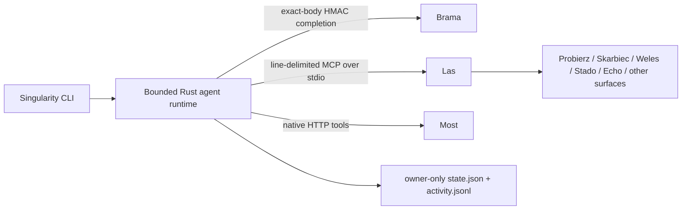

<!-- wisent-banner:start -->
<p align="center">
  
</p>
<!-- wisent-banner:end -->

<!-- wisent-readme-signals:start -->
[](https://github.com/wisent-ai/singularity) [](https://github.com/wisent-ai/singularity/issues) [](https://wisent.ai) [](https://discord.gg/qRjpkthq54) [](https://www.linkedin.com/company/wisent-ai/) [](https://x.com/wisentai) [](https://calendly.com/lbartoszcze)
<!-- wisent-readme-signals:end -->

# Singularity

**Singularity is an auditable Rust runtime for autonomous Wisent agents that
bounds model/tool cycles, cost, state, and external effects while reusing the
Wisent platform contracts that own inference, tools, credentials, and messaging.**

[Quick start](#quick-start) · [Commands](#primary-interfaces) ·
[Configuration](#configuration) ·
[Canonical repository](https://github.com/wisent-ai/singularity)

Version `0.3.0` is a public development runtime. It can execute effectful tools
and send messages when enrolled; inspect configuration and tool authority before
using it with production systems.

## Problem and intended users

An autonomous loop is easy to demonstrate and difficult to operate safely. It
must preserve typed tool calls, reject malformed results, charge each cycle once,
retain recoverable state, bound execution, distinguish ambiguous remote failure
from a safe retry, and keep provider or service credentials outside the model
transcript.

Singularity serves:

- **agent developers** building a native local runtime around existing Wisent
  services;
- **operators** running bounded agents with explicit identities, budgets,
  required tool surfaces, and owner-controlled state;
- **reviewers** inspecting a versioned snapshot and append-only activity journal;
- **platform teams** integrating Brama, Las, Most, Stado, Skarbiec, Weles,
  Probierz, Echo, and other canonical services without duplicating them.

## Product boundaries

### Included

- a Rust model-and-tool loop with sequential validated tool execution;
- native OpenAI-compatible completion calls to Brama with exact-body HMAC;
- dynamic namespaced MCP discovery through a supervised Las child process;
- native Most health, chat-creation, and text-message tools;
- token and instance cost accounting with a starting balance;
- bounded tool rounds, cycle interval, cancellation, and budget exhaustion;
- atomic versioned `state.json` snapshots and append-only `activity.jsonl`;
- owner-only state and credential-file boundaries on Unix;
- `run`, `once`, `doctor`, and `tools` operator commands.

### Explicit non-goals

- Singularity does not implement model providers, local model serving,
  subscription routing, provider retries, or reauthentication; Brama owns those.
- It does not implement a credential vault; Skarbiec owns credentials.
- It does not copy child MCP services; Las federates their canonical contracts.
- It does not implement Apple/Twilio transports, worker affinity, or messaging
  storage; Most owns those.
- It does not provide a Python runtime, Python package, dynamic Python skills,
  compatibility shim, self-modifying agent, crypto wallet, or skill marketplace.
- Effectful remote calls are not automatically retried after ambiguous network or
  protocol failure.
- A healthy process without an active backend is not treated as send-ready.
- Higher-risk capabilities require their own approval gate; installing the local
  runtime is not blanket authority to spend, communicate, deploy, or alter data.

### Supported environment and current capability

| Surface | Requirement | Current state |
|---|---|---|
| Runtime and CLI | Rust 1.85+ compatible with `Cargo.lock` | Implemented |
| Brama inference | reachable compatible endpoint and HMAC identity | Required to run a cycle |
| Las tools | executable entrypoint and selected child surfaces | Required according to policy |
| Most messaging | service origin and scoped token file | Native optional tools |
| Local state and audit | owner-writable state directory | Implemented |
| Python API / direct provider SDK | — | Removed / not supported |
| Managed autonomous operation | explicit organization enrollment | Separate operated capability |

## Core use cases

### Inspect runtime readiness

- **Actor:** an operator preparing an enrolled agent.
- **Initial state:** configuration points to Brama, Las, Most, state, and
  owner-only secret files.
- **Outcome:** `doctor` reports model availability, message-send readiness, Las
  federation, and required MCP surfaces.
- **Boundary:** readiness does not authorize a subsequent effectful tool call.

### Run one bounded cycle

- **Actor:** an agent developer or operator.
- **Initial state:** identity, budget, model, required surfaces, and tool-round
  bound are explicit.
- **Outcome:** `once` performs one cycle and prints a JSON report; the runtime
  persists state and one corresponding activity sequence.
- **Boundary:** tools may have external effects. Use only scoped test resources or
  an explicitly authorized production policy.

### Operate a recurring agent

- **Actor:** an organization operator.
- **Initial state:** the same enrollment is production-approved, monitored, and
  funded.
- **Outcome:** `run` repeats bounded cycles until cancellation or budget
  exhaustion.
- **Boundary:** organization scheduling, retained evidence, service availability,
  and human approval remain managed control-plane responsibilities.

### Audit and recover an agent

- **Actor:** an operator or reviewer.
- **Initial state:** the owner-only state directory is available.
- **Outcome:** `state.json` shows the current versioned identity, budget,
  transcript, actions, and created Most resources; `activity.jsonl` shows
  lifecycle, cost, model, and tool outcomes.
- **Boundary:** unsupported schemas and corrupted state fail closed; the journal
  is operational evidence, not proof that every downstream system committed an
  ambiguous request.

## How Singularity works


```mermaid
flowchart LR
    CLI[Singularity CLI] --> Agent[Bounded Rust agent runtime]
    Agent -->|exact-body HMAC completion| Brama
    Agent -->|line-delimited MCP over stdio| Las
    Las --> Children[Probierz / Skarbiec / Weles / Stado / Echo / other surfaces]
    Agent -->|native HTTP tools| Most
    Agent --> State[owner-only state.json + activity.jsonl]
```

Each cycle appends current budget and recent outcomes, asks Brama for a typed
completion, validates and executes native tool calls sequentially, returns every
success or failure as a structurally valid tool message, charges configured
rates exactly once, atomically saves state, appends activity, and stops on a
final response, bound, exhaustion, or cancellation.

Canonical ownership stays outside this repository:

- **Brama:** provider/model selection, subscription routing, retry chains,
  credential brokering, reauthentication, and inference;
- **Las:** current namespaced tool catalogue and MCP child supervision;
- **Most:** communication transport, workers, storage, and webhook logic;
- **Skarbiec:** secret custody and scoped materialization;
- **child products:** their own policy, evidence, and side effects.

## Quick start

This safe path builds the runtime and prints its command contract. It invokes no
model and executes no tool.

### Prerequisites

- Git;
- Rust 1.85 or newer;
- a Unix-like host for the documented owner-only permission behavior.

```bash
git clone https://github.com/wisent-ai/singularity.git
cd singularity
cargo build --locked
cargo run --locked -- --help
```

Expected result: Cargo builds the `singularity` binary and the second command
prints `run`, `once`, `doctor`, and `tools`. No production enrollment is bundled.

Install the source build:

```bash
cargo install --path . --locked
singularity --help
```

Before a real cycle, provision separate scoped identities and run
`singularity doctor`. `doctor`, `tools`, `once`, and `run` may contact configured
services; review their endpoints and authority first.

## Primary interfaces

```text
singularity run       # recurring cycles until cancellation or budget exhaustion
singularity once      # one bounded cycle with a JSON report
singularity doctor    # configuration and service readiness
singularity tools     # merged Las and native Most tool catalogue
```

Las tools retain canonical `<surface>__<tool>` names. If a required child is
unavailable, startup fails rather than substituting another implementation.

## Configuration

### Agent, budget, and state

| Variable | Purpose |
|---|---|
| `SINGULARITY_AGENT_NAME` | agent display name |
| `SINGULARITY_AGENT_TICKER` | stable agent ticker |
| `SINGULARITY_AGENT_TYPE` | agent category |
| `SINGULARITY_SPECIALTY` | preferred domain |
| `SINGULARITY_STATE_DIR` | owner-only state and activity directory |
| `SINGULARITY_STARTING_BALANCE_USD` | initial budget |
| `SINGULARITY_INSTANCE_USD_PER_HOUR` | instance cost rate |
| `SINGULARITY_CYCLE_INTERVAL_SECS` | pause between cycles |
| `SINGULARITY_MAX_TOOL_ROUNDS` | per-cycle model/tool bound |

### Brama

| Variable | Purpose |
|---|---|
| `BRAMA_BASE_URL` | Brama service origin |
| `BRAMA_MODEL` | model or selector such as `any` or `task:<name>` |
| `BRAMA_AGENT_ID` | HMAC identity |
| `BRAMA_HMAC_SECRET_FILE` | owner-only file containing the matching secret |
| `BRAMA_MAX_TOKENS` | completion output bound |
| `BRAMA_TEMPERATURE` | sampling temperature |
| `BRAMA_INPUT_PRICE_USD_PER_MILLION` | prompt-token budget rate |
| `BRAMA_OUTPUT_PRICE_USD_PER_MILLION` | completion-token budget rate |

The completion request is serialized once, signed over those exact bytes, and
sent from the same byte buffer. Provider credentials never enter the transcript
or activity journal.

### Las, Most, and operations

| Variable | Purpose |
|---|---|
| `LAS_COMMAND` / `LAS_MCP_ENTRYPOINT` | supervised Las process |
| `LAS_ONLY` / `LAS_SKIP` | selected or excluded surfaces |
| `SINGULARITY_REQUIRED_SURFACES` | prefixes required after discovery |
| `SINGULARITY_MCP_TIMEOUT_SECS` | Las request deadline |
| `MOST_BASE_URL` | Most service origin |
| `MOST_SERVICE_TOKEN_FILE` | owner-only Most bearer file |
| `SINGULARITY_HTTP_TIMEOUT_SECS` | Brama and Most request deadline |
| `SINGULARITY_SHUTDOWN_GRACE_SECS` | graceful Las shutdown period |
| `RUST_LOG` | Rust tracing filter |

## Operational model

- **State:** atomic `state.json` plus append-only `activity.jsonl` under the
  configured owner-only directory.
- **Credentials:** secret file paths are bootstrap inputs; raw values are not
  serialized into state or model context.
- **Observability:** structured cycle reports, tracing, readiness checks, budget,
  state versions, and activity events.
- **Recovery:** unsupported versions or corruption fail closed; restore the prior
  owner-controlled snapshot and reconcile ambiguous downstream effects before
  replaying work.
- **Cost:** configured model-token and instance rates are charged by the local
  runtime; hosted models, compute, messaging, storage, and retained evidence are
  separate operated costs.

## Project status and support

- **Maturity:** public development runtime, version `0.3.0`.
- **Release:** source and release badges report repository publication; they do
  not promise a hosted SLA or production enrollment.
- **Breaking cutover:** the former `singularity-ai` Python distribution and
  `from singularity import ...` API no longer exist; no compatibility shim is
  retained.
- **Issues:** [`wisent-ai/singularity`](https://github.com/wisent-ai/singularity/issues).
- **Security:** use private GitHub Security Advisories; never attach state,
  transcripts, credentials, organization policy, or production endpoints to a
  public issue.
- **License:** MIT; see [`LICENSE`](LICENSE).